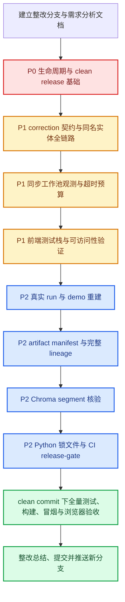

# 20260916 第四轮复核遗留问题整改工作单

> 文档类型：代码、测试、数据、发布与文档的后续整改工作单。  
> 编制日期：2026-09-16。  
> 项目根目录：`F:\python\python_space\china-war\RAG`。  
> 上游审核依据：`docs/changes/20260915-round4-review-audit-and-next-optimization.md`。  
> 整改结果复核依据：`docs/changes/20260915-round4-review-fix-summary-2.md` 及对应工作区代码、测试、构建产物和 Git 状态。  
> 范围：仅整改 `RAG/`，严格排除 `RAG/new/`。  
> 当前裁定：29 项原任务中，16 项已完成、8 项部分完成、5 项未完成；本文只展开仍需处理的 13 项，并为已完成项设置回归门禁。

---

## 一、文档用途

本文档用于直接交给后续开发模型执行整改。每个任务均明确：

1. **问题在哪里**：文件、代码位置、当前行为和影响；
2. **如何解决**：契约、代码、测试、数据和发布层面的具体修改方案；
3. **解决标准是什么**：可通过自动化测试、接口结果、Git 状态或制品校验客观判断的验收条件。

后续模型不得仅修改说明文档或增加绕过测试的特殊分支来宣称完成。所有“已完成”状态必须同时具备：

- 实际实现；
- 针对根因的自动化测试；
- 全量回归通过；
- 文档口径同步；
- 若涉及发布，则绑定 clean commit 和可验证制品。

---

## 二、整改范围与优先级

| 优先级 | 编号 | 当前状态 | 摘要 |
| --- | --- | --- | --- |
| P0 | P0-3 | 部分完成 | Embedding 同步 OpenAI 客户端没有生命周期关闭路径 |
| P0 | P0-4 | 未完成 | 工作区、测试证据和制品没有绑定同一 clean commit |
| P1 | P1-2 | 部分完成 | correction 的 add 动作仍接受不符合声明的兼容字段 |
| P1 | P1-3 | 部分完成 | 同名候选 replace 没有把新候选 `entity_id` 传到后端 |
| P1 | P1-5 | 部分完成 | 有界线程池已建立，但 active/queued 观测与严格超时预算未闭合 |
| P1 | P1-12 | 部分完成 | 有 Node 契约测试，但缺 Vitest、Vue Test Utils、Playwright 与 CI 端到端执行 |
| P1 | P1-13 | 部分完成 | 可访问性代码已增加，但缺浏览器级键盘、焦点与语义验证 |
| P2 | P2-1 | 未完成 | `20260915_v1` demo 文件存在但仍是旧版本产物，接口应返回 503 |
| P2 | P2-3 | 部分完成 | artifact manifest 已生成，但当前校验失败且来自 dirty 工作区 |
| P2 | P2-4 | 未完成 | source→snapshot→index→eval→demo→release 数据血缘未闭合 |
| P2 | P2-5 | 未完成 | Chroma collection→segment 映射、孤儿判定与清理审计未完成 |
| P2 | P2-6 | 未完成 | Python 依赖仍未生成带哈希的锁文件 |
| P2 | P2-7 | 部分完成 | 基础 CI 已写，但 release-gate 不可触发，release artifact 不完整 |

---

## 三、推荐实施流程



---

# 四、P0 发布阻断整改

## P0-3：补齐全部外部客户端的生命周期关闭

### 1. 问题在哪里

主要位置：

- `server/runtime.py:43-69`
- `data/index/embeddings.py:31-72`
- `server/api.py` 的 lifespan 退出逻辑
- `tests/test_release_guards.py` 的 shutdown 测试

当前 `Runtime.shutdown()` 已改为异步，并会关闭：

- `generate.llm`；
- `question.llm`。

但 `data/index/embeddings.py` 中的 Embedding 客户端通过以下方式创建：

```python
client = OpenAI(...)
```

客户端被封装在 `embed_fn` 闭包中，Runtime 无法访问，也无法在服务退出时调用 `close()`。在线向量查询启用时，该 HTTP 连接池仍可能在热重载、测试重复启动或正常停机后残留。

### 2. 根因

`build_embed_fn()` 只返回 callable，没有返回可关闭资源，也没有定义统一的资源生命周期协议。Runtime 的资源列表因此不完整。

### 3. 如何解决

推荐采用显式资源对象，不再只返回匿名闭包：

1. 在 `data/index/embeddings.py` 定义带生命周期的类，例如 `EmbeddingClient`：
   - `embed(texts)` 或 `__call__(texts)`；
   - `close()`；
   - 保存底层 OpenAI client；
   - 关闭操作幂等。
2. `build_embed_fn()` 可改为返回该对象，或返回 `(embed_fn, closer)`；优先选择可读性更高的对象形式。
3. 将 Embedding 资源挂到 `Runtime`，例如：
   - `runtime.embedding_client`；或
   - `runtime.resources` 统一资源表。
4. `Runtime.shutdown()` 统一遍历同步和异步资源：
   - 优先 `aclose()` 并 await；
   - 否则调用 `close()`；
   - 单个资源关闭失败只记录 warning；
   - 其他资源仍继续关闭；
   - 重复 shutdown 不得重复关闭同一资源。
5. lifespan 退出顺序建议为：
   - 停止接受新请求；
   - 关闭同步工作池；
   - 关闭 Runtime 外部客户端；
   - 输出资源释放日志。

### 4. 必须新增或修改的测试

- Embedding 同步 closer 被调用一次；
- Async LLM closer 被 await 一次；
- 实体兜底同步 closer 被调用一次；
- 重复执行 shutdown 不重复关闭；
- 一个 closer 抛异常时其他 closer 仍执行；
- lifespan 退出没有 `coroutine was never awaited`、未关闭连接池或线程池警告。

### 5. 验收标准

- Runtime 能枚举全部外部 HTTP 客户端；
- 在线 Embedding 开启时，服务退出会调用其 `close()`；
- 所有 shutdown 测试通过；
- 全量 pytest 无资源警告；
- 热重载和重复启动后不持续增加 HTTP 连接、后台线程或未关闭客户端。

---

## P0-4：建立 clean commit、验证证据与发布版本的唯一绑定

### 1. 问题在哪里

当前仓库存在以下状态：

- 分支 `ragv5-demo-deploy` 相对远端 ahead 3；
- 大量核心文件未提交；
- CI、守护测试、前端测试、制品脚本和整改文档仍为未跟踪文件；
- `data/release/artifact-manifest.json` 记录 `git_dirty=true`；
- 当前 manifest 校验失败；
- 验证结果没有绑定同一 clean commit。

涉及位置：

- `server/runtime.py` 的 release metadata；
- `lib/release_info.py`；
- `server/api.py:/api/health`；
- `scripts/build_artifact_manifest.py`；
- `.github/workflows/ci.yml`；
- `data/release/artifact-manifest.json`；
- `docs/changes/` 下的审核与整改记录。

另外，`server/runtime.py` 中 `version_selection` 主要依据 `settings.active_version` 判断。如果版本来自 CLI `--version`，health 仍可能错误显示为 `latest_scan`，需要一并核查。

### 2. 根因

代码实现、测试证据、Git commit 和发布制品分别产生，没有通过统一 release 流程建立一一对应关系。

### 3. 如何解决

1. 完成本文所有 P0/P1/P2 修改后，清理辅助文件和非交付产物。
2. 确认所有应交付文件已被 Git 跟踪，尤其是：
   - `.github/workflows/ci.yml`；
   - `tests/test_release_guards.py`；
   - `tests/test_online_guards.py`；
   - `frontend/tests/`；
   - `frontend/scripts/`；
   - `lib/release_info.py`；
   - `scripts/build_artifact_manifest.py`；
   - `requirements-dev.txt`；
   - 本工作单及最终整改总结。
3. 修正版本选择元数据：
   - `cli_explicit`；
   - `env_pinned`；
   - `latest_scan`；
   三种来源应能在 health 中准确区分。
4. 在 clean commit 上运行完整验证。
5. 生成证据目录或结构化报告，至少包含：
   - commit SHA；
   - branch；
   - `git status --porcelain` 结果；
   - Python/Node 版本；
   - 锁文件 hash；
   - health JSON；
   - pytest 原始结果；
   - 前端 verify 原始结果；
   - demo 接口结果；
   - manifest build/verify 结果；
   - smoke 报告；
   - 浏览器 E2E 结果。
6. manifest 和 release 打包必须在 dirty 检查之后执行；任何文件变化都应使 release 流程重新开始。

### 4. 必须新增或修改的测试

- CLI 显式版本时 `version_selection=cli_explicit`；
- 环境变量固定版本时为 `env_pinned`；
- 开发模式自动扫描时为 `latest_scan`；
- dirty 工作区执行 release build 必须失败；
- clean 工作区可生成 release ID；
- health 的 commit、version、config fingerprint、manifest hash 与发布报告一致。

### 5. 验收标准

- `git status --porcelain` 为空；
- 所有交付文件已提交；
- release manifest 中 `git_dirty=false`；
- health 返回的 release 信息可唯一反向定位源码、配置和数据；
- 同一 commit 下完成测试、构建、manifest、smoke 和浏览器验证；
- 证据报告中的 commit SHA 与运行服务的 health commit 完全一致；
- 分支已推送到 GitHub，不直接推送主分支。

---

# 五、P1 正确性与稳定性整改

## P1-2：统一 correction 动作契约，移除声明与实现偏差

### 1. 问题在哪里

主要位置：

- `contracts/request.py:249-318`
- `frontend/src/types/contract.ts`
- `frontend/src/stores/session.ts`
- `tests/test_release_guards.py`

当前文档和修复总结声称：

- add 必须有 `name + entity_type`；
- replace 必须有 `original + replacement`；
- remove 必须有 `original`。

但后端 add 仍允许：

```json
{
  "action": "add",
  "replacement": "白起",
  "entity_type": "人物"
}
```

代码会把 `replacement` 兼容转换成 `name`。这不一定会造成运行错误，但与已经声明的严格契约不一致，也会使非法或旧格式请求继续长期存在。

### 2. 如何解决

选择并固定一种策略，不允许文档与代码继续不一致。推荐严格模式：

1. add 只接受：
   - `action`；
   - `entity_id` 可选；
   - `name` 必填；
   - `entity_type` 必填。
2. replace 重新设计后应接受：
   - `source_entity_id` 优先；
   - `original` 作为兼容字段；
   - `replacement_entity_id` 优先；
   - `replacement` 作为无 ID 的兼容字段；
   - `entity_type` 可选。
3. remove 接受：
   - `source_entity_id` 优先；
   - `original` 作为兼容字段。
4. 不相关字段采用明确规则：
   - 推荐拒绝并返回 400；或
   - 只在有明确版本迁移期时规范化，但必须记录 warning 和弃用期限。
5. 所有嵌套类型错误统一转换成 `RequestValidationError`，不得形成 500。
6. 更新前端 TypeScript 类型、接口文档和示例 payload。

### 3. 必须新增或修改的测试

- `add` 缺少 name 返回 400，即使有 replacement；
- `add` 缺少 entity_type 返回 400；
- `replace` 缺源实体定位字段返回 400；
- `replace` 缺替换目标定位字段返回 400；
- `remove` 缺源实体定位字段返回 400；
- action 为数组、对象、数字、null 均稳定返回 400；
- 多余字段按选定策略稳定拒绝或规范化；
- 合法请求序列化后前后端字段一致。

### 4. 验收标准

- correction 契约在代码、TypeScript 类型、接口文档和测试中完全一致；
- 所有非法 correction 返回结构化 400；
- 不存在静默 no-op；
- 不存在依赖未声明兼容字段才能成功的请求。

---

## P1-3：实现同名实体的源 ID 与目标 ID 全链路纠正

### 1. 问题在哪里

主要位置：

- `frontend/src/components/chat/MessageBubble.vue:78-156`
- `frontend/src/stores/session.ts:794-869`
- `frontend/src/types/contract.ts`
- `contracts/request.py:124-172`
- `server/query/understand.py:329-391`
- `tests/test_release_guards.py:376-416`
- `frontend/tests/`

UI 已能使用候选 `entity_id` 区分同名不同朝代选项，但 replace 请求中的 `entity_id` 是旧实体 ID，而不是用户选择的新候选 ID。后端再按 replacement 名称查找新 ID，并返回同名列表第一项。

因此以下场景仍可能错误：

```text
当前识别：井陉之战（战国，event_zhan）
用户选择：井陉之战（西汉，event_han）
实际结果：后端仍可能取 event_zhan 或同名列表第一项
```

### 2. 根因

一个 `entity_id` 字段同时承担了：

- 定位被替换实体；
- 定位替换目标实体。

这两个语义不能共用一个字段。

### 3. 如何解决

1. 重构 correction 契约，明确区分：
   - `source_entity_id`：要移除或替换的现有实体；
   - `replacement_entity_id`：用户选中的新实体；
   - add 可直接使用 `replacement_entity_id` 或独立 `entity_id`，但命名必须统一。
2. 前端 replace 请求必须传：

```json
{
  "action": "replace",
  "source_entity_id": "event_zhan",
  "replacement_entity_id": "event_han",
  "original": "井陉之战",
  "replacement": "井陉之战",
  "entity_type": "事件"
}
```

3. 后端应用规则：
   - 优先按 `source_entity_id` 找到被替换实体；
   - 优先按 `replacement_entity_id` 获取目标实体完整信息；
   - 目标 ID 存在时不得再调用“按名称取第一项”；
   - 使用目标实体真实的 standard_name、dynasty、type 和 entity_id；
   - 无 ID 的旧请求才允许名称兼容降级。
4. `_entity_id_of()` 不得在同名多候选时静默返回第一项：
   - 唯一匹配时可返回；
   - 多匹配时必须要求 ID，或返回明确歧义错误。
5. UI 展示继续保留标准名、朝代、类型。
6. 缓存键必须包含 source/replacement 两个 ID，避免纠正请求命中旧答案缓存。

### 4. 必须新增或修改的测试

必须使用真实的同名不同朝代实体，完成以下全链路测试：

1. 前端下拉生成两个不同 key；
2. 用户选择第二个实体后 payload 包含正确 `replacement_entity_id`；
3. 后端解析后两个 ID 均保留；
4. `_apply_corrections()` 最终实体 ID 等于用户选择的 ID；
5. 后续图谱和文本检索使用目标 ID；
6. 缓存键随目标 ID 变化；
7. 同名无 ID 请求返回歧义错误或进入明确兼容分支；
8. 组件测试验证用户点击不同候选产生不同 payload。

### 5. 验收标准

- 用户选择哪个候选 ID，后端最终实体和检索就必须落到该 ID；
- 同名不同朝代不再依赖列表顺序；
- 不允许通过 `standard_name` 猜测多个同名实体中的目标；
- 前端组件、请求 payload、后端契约、纠正应用、缓存和最终检索全链路测试通过。

---

## P1-5：补齐同步工作池的观测、取消语义与严格预算

### 1. 问题在哪里

主要位置：

- `server/sse.py:48-149`
- `server/api.py:/api/health`
- `config/settings.py:251-275`
- `tests/test_release_guards.py`

当前有界线程池已限制 `max_workers + max_queue`，但统计只有：

- `in_flight`；
- `rejected`；
- `completed`；
- `peak_in_flight`。

它没有区分：

- 正在执行的 active；
- 等待执行的 queued。

此外，外部调用预算校验使用 `>`，因此允许预算与 SSE deadline 完全相等；考虑调度、序列化和收尾时间，实际应保留安全余量。

### 2. 如何解决

1. 分离统计：
   - `active`；
   - `queued`；
   - `rejected`；
   - `completed`；
   - `cancelled_before_start`；
   - `running_after_disconnect`，如能观测。
2. 在线程任务真正开始时将 queued 转为 active；任务结束后减少 active。
3. Future 在排队阶段被取消时，应尽量取消尚未开始的任务并更新统计。
4. 请求断连后：
   - 已运行的同步调用允许运行到自身超时；
   - 尚未运行的排队任务应取消；
   - 不得继续无限占用队列。
5. 超时预算增加安全余量配置，例如：

```text
external_budget + shutdown_margin < SSE_MAX_DURATION_SECONDS
```

6. `/api/health` 返回上述统计，并注明统计是进程级还是实例级。
7. 文档明确多实例生产环境仍建议使用 Redis 限流和独立任务隔离。

### 3. 必须新增或修改的测试

- worker 全忙时新任务进入 queued；
- queued 达上限后新任务被拒绝；
- active 和 queued 数量准确；
- 排队任务在请求取消后不会继续启动；
- 运行中同步函数不会阻塞事件循环；
- shutdown 会取消未开始任务并拒绝新任务；
- 外部预算等于 deadline 时配置校验失败；
- health 返回 active/queued/rejected。

### 4. 验收标准

- 大量断连请求不会形成无界队列；
- health 可独立查看 active、queued、rejected；
- 排队任务可取消；
- 外部调用预算严格小于总 deadline 并留有收尾余量；
- 默认 executor 不被 RAG 同步工作占满。

---

# 六、P1 前端测试与可访问性整改

## P1-12：建立正式前端单元、组件和浏览器端测试体系

### 1. 问题在哪里

主要位置：

- `frontend/package.json`
- `frontend/scripts/run-tests.mjs`
- `frontend/scripts/e2e-check.mjs`
- `frontend/tests/`
- `.github/workflows/ci.yml`

当前已有 24 条 Node 内置测试，覆盖 SSE parser、超时、状态机、持久化等逻辑，这是有效基础，但未达到原审计要求：

- 没有 Vitest；
- 没有 Vue Test Utils；
- 没有 Playwright；
- `test:e2e` 只是 Node 契约脚本，不是浏览器 E2E；
- CI 没有执行 `npm run test:e2e`；
- 组件交互和真实焦点行为未被自动化验证。

### 2. 如何解决

1. 添加并锁定开发依赖：
   - `vitest`；
   - `@vue/test-utils`；
   - `jsdom` 或 `happy-dom`；
   - `@playwright/test`。
2. 保留现有 Node 契约测试也可以，但应重新命名，避免把它冒充浏览器 E2E，例如：
   - `test:contract`；
   - `test:unit`；
   - `test:component`；
   - `test:e2e`。
3. Vitest 覆盖：
   - SSE CRLF、多行 data、UTF-8 跨分块、EOF 残帧；
   - connect/idle/total timeout；
   - error/done 状态转移；
   - history/supersede；
   - 单流；
   - 持久化迁移与配额错误。
4. Vue Test Utils 覆盖：
   - 重试按钮；
   - 同名候选选择与 payload；
   - 引用导航；
   - cancelled/failed/empty 面板；
   - Map/SubGraph 动态加载失败和重试。
5. Playwright 覆盖：
   - 服务断流；
   - 刷新恢复半截正文；
   - 移动抽屉；
   - Escape 和焦点回退；
   - Tab/Shift+Tab 焦点陷阱；
   - 面板左右键切换；
   - mock chunk 加载失败；
   - 键盘完成提问、查看证据和关闭抽屉。
6. CI 中执行上述全部层级，并保存 Playwright report、截图或 trace 作为失败 artifact。

### 3. 验收标准

- `package.json` 至少提供：

```text
npm run test:unit
npm run test:component
npm run test:e2e
npm run verify
```

- `npm ci` 后无需人工操作即可执行；
- CI 真正执行浏览器级 Playwright，而不是仅检查脚本是否存在；
- 所有关键状态机、组件交互和移动端路径都有自动化测试；
- 测试失败会使 CI 失败。

---

## P1-13：完成可访问性的浏览器级验收

### 1. 问题在哪里

主要位置：

- `frontend/src/App.vue`
- `frontend/src/components/panel/PanelPane.vue`
- `frontend/src/components/panel/EvidenceView.vue`
- `frontend/src/components/chat/ChatInput.vue`
- `frontend/src/components/chat/MessageBubble.vue`
- `frontend/src/components/ui/ToastView.vue`
- `frontend/src/styles.css`

现有代码已增加 dialog、aria-modal、焦点陷阱、Escape、tablist、aria-expanded、live region 和 reduced-motion，但目前主要通过静态检查确认，没有在真实浏览器中验证。

### 2. 如何解决

1. 使用 Playwright 验证桌面和移动 viewport。
2. 可增加 axe-core 自动扫描，但不能只依赖 axe；焦点顺序和键盘操作仍需行为测试。
3. 检查抽屉打开后：
   - 焦点进入抽屉；
   - Tab 不离开抽屉；
   - Shift+Tab 正确循环；
   - Escape 关闭；
   - 关闭后焦点回到触发按钮。
4. 检查 tabs：
   - `role=tablist/tab/tabpanel` 对应；
   - `aria-selected` 正确；
   - 左右键切换并移动焦点；
   - 隐藏面板不可被键盘访问。
5. 检查动态内容：
   - toast 被 live region 宣告；
   - 流式回答不会造成过量重复宣告；
   - 证据展开按钮有可理解名称和状态。
6. 检查 reduced-motion 下动画和滚动行为。
7. 检查颜色对比度和仅颜色表达状态的问题。

### 3. 验收标准

- 键盘无需鼠标即可完成提问、打开面板、切换 tab、展开证据和关闭抽屉；
- 抽屉焦点不会逃逸；
- 所有交互控件具有可访问名称；
- Playwright 可访问性用例在 CI 中通过；
- axe 扫描不存在 serious/critical 问题，若有例外必须记录理由。

---

# 七、P2 数据与制品整改

## P2-1：生成与 `20260915_v1` 一致的真实 demo 制品

### 1. 问题在哪里

文件：

- `data/eval/20260915_v1/demo_examples.json`
- `scripts/gen_demo_examples.py`
- `server/api.py` 的 `/api/demo/examples`
- `scripts/smoke_deploy.py`
- `docs/features/08-demo-mode.md`

文件虽然存在，但内部仍为：

```json
"version": "20260904_v2"
```

它属于旧 run，不是当前活跃版本的可发布 demo 数据。新的严格校验会正确返回 503。

### 2. 如何解决

1. 先完成 clean commit 和固定配置。
2. 固定：
   - `RAG_ACTIVE_VERSION=20260915_v1`；
   - 模型、endpoint、参数；
   - config fingerprint；
   - commit SHA。
3. 使用真实模型执行完整评测 run。
4. run metadata 必须包含：
   - version；
   - source commit；
   - model；
   - endpoint 类型；
   - generation parameters；
   - config fingerprint；
   - `generation_backend=real_llm`；
   - started/finished 时间；
   - 成功、失败、截断数量。
5. 运行 `gen_demo_examples.py --version 20260915_v1 --run <run> --measure`。
6. 输出中增加 `measurement_mode=real_llm`。
7. 禁止在 LLM 不可用时把离线启发式结果标为真实测量。
8. 重跑 demo API、smoke 和前端示例点击测试。

### 3. 验收标准

- demo 顶层 version 为 `20260915_v1`；
- source_run 的版本、commit 和配置与 runtime 一致；
- 每条示例具有有效测量字段；
- `/api/demo/examples` 返回 200；
- 前端欢迎页示例可点击并成功完成；
- smoke 不再因 demo 503 失败；
- 不沿用旧版本时延冒充新版本数据。

---

## P2-3：让 artifact manifest 稳定、完整并可重复校验

### 1. 问题在哪里

主要位置：

- `scripts/build_artifact_manifest.py`
- `data/release/artifact-manifest.json`
- `data/index/20260915_v1/vectors/chroma/chroma.sqlite3`
- `lib/release_info.py`
- `/api/health`

当前 manifest 已覆盖 37 个文件，但存在：

- manifest 在 dirty 工作区生成；
- Chroma SQLite 当前哈希与清单不一致；
- Python lock 文件尚不存在；
- verify 只检查清单中已有条目时，需要确认能否检测新增但未记录的发布文件；
- 正常测试或打开 Chroma 可能改写 SQLite，使 release hash 不稳定。

### 2. 如何解决

1. 明确发布制品必须只读：
   - 检查 Chroma/PersistentClient 是否会在只读查询时写元数据；
   - 测试不得直接修改正式 `data/index/20260915_v1`；
   - 需要写入的测试应复制到临时目录。
2. manifest build 前检查 clean worktree。
3. 完善 required file 规则并检测：
   - 缺失文件；
   - 内容变化；
   - 大小变化；
   - 新增但未登记的运行时文件；
   - 非法软链接或路径逃逸。
4. 覆盖：
   - snapshot 全部运行时 JSON；
   - index/chunks/FTS/ids/embeddings；
   - Chroma 元数据库与 segment；
   - eval/questions/demo；
   - frontend dist；
   - Python lock；
   - package-lock；
   - lineage；
   - smoke report；
   - 版本和 commit 元数据。
5. 对 SQLite 可选择：
   - 构建完成后冻结并只读打开；或
   - 对逻辑导出/规范化 dump 计算 hash；或
   - 发布包校验物理文件，运行时复制到可写目录。
6. manifest 本身再生成独立 SHA256SUMS。

### 3. 必须新增或修改的测试

- 任一列举文件改变时 verify 失败；
- 新增未登记的 Chroma segment 时 verify 失败；
- 测试运行前后正式发布制品 hash 不变化；
- manifest 在 dirty 工作区无法生成 release 版本；
- 路径逃逸和软链接异常被拒绝；
- clean build 后连续 verify 两次均通过。

### 4. 验收标准

- clean commit 下 manifest build 成功；
- manifest 中 `git_dirty=false`；
- 全量测试前后 manifest verify 均通过；
- 任何运行时制品变化都能被检测；
- 在另一目录解包后仍能 verify；
- health 返回的 manifest hash 与文件实际 hash 一致。

---

## P2-4：建立完整、可反向追溯的数据血缘

### 1. 问题在哪里

当前：

- snapshot manifest 主要记录路径和数量；
- index manifest 记录部分构建参数；
- questions meta 记录题库来源 hash；
- artifact manifest 记录发布文件 hash。

但缺少统一 lineage 将这些层连接起来，且 snapshot 中上游数据库和原始文本只有本机绝对路径，没有大小、hash、授权状态和源码 commit。

### 2. 如何解决

新增规范化 lineage，例如：

```text
data/release/lineage.json
```

至少记录：

1. source：
   - 上游数据库逻辑名称；
   - 文件大小；
   - SHA-256；
   - 原始文本 hash；
   - 授权/来源说明。
2. snapshot：
   - version；
   - 构建命令；
   - 构建 commit；
   - 配置 fingerprint；
   - 输入 source hashes；
   - 输出 manifest hash。
3. index：
   - chunk 参数；
   - FTS 工具/SQLite 版本；
   - embedding model/dimensions；
   - Chroma 版本；
   - 复用向量来源和旧 embeddings hash。
4. eval：
   - questions 来源；
   - run ID；
   - model/config/commit；
   - scores/traces hashes。
5. demo：
   - source run；
   - measurement mode；
   - 过滤规则；
   - 输出 hash。
6. release：
   - Python/Node 版本；
   - lockfile hashes；
   - frontend dist hash；
   - artifact manifest hash；
   - smoke report hash。

避免把无法在其他机器复现的本机绝对路径当成唯一来源标识。可同时保留原路径作为附加字段，但必须有稳定 hash。

### 3. 验收标准

- `source → snapshot → index → vectors → eval → demo → frontend/release` 每层都有明确父节点；
- 任一输出都能反向追溯到输入 hash、命令、配置和 commit；
- lineage 通过 JSON schema 校验；
- artifact manifest 包含 lineage；
- health 或 release report 暴露 lineage hash。

---

## P2-5：完成 Chroma collection 与 segment 核验

### 1. 问题在哪里

位置：

- `data/index/20260915_v1/vectors/chroma/`
- Chroma SQLite 元数据库；
- `ids.json`；
- index manifest。

存在多个 UUID segment 目录，但仅凭目录数量不能判断是否是孤儿。当前尚未建立 collection→segment→scope/type 映射，也没有清理审计 JSON。

### 2. 如何解决

1. 在只读副本或备份上执行核验，禁止直接试删正式数据。
2. 使用当前 Chroma API 或 SQLite 元数据查询：
   - collection name/id；
   - segment id；
   - segment scope/type；
   - collection 与 segment 引用关系。
3. 输出审计文件，例如：

```text
data/release/chroma-segment-audit.json
```

4. 对比：
   - collection count；
   - `ids.json` 数量 9544；
   - Chroma count；
   - embeddings 行数；
   - index manifest count。
5. 随机抽样 ID：
   - get；
   - query；
   - metadata 与 chunk 对应。
6. 仅把无任何 collection/metadata 引用的 segment 标为 orphan。
7. 若确实存在孤儿：
   - 先完整备份；
   - 记录删除前 hash；
   - 删除后重跑 count、随机 query、manifest 和 smoke。
8. 若没有孤儿，也必须保留审计结论，不应为了“完成任务”强行删除目录。

### 3. 验收标准

- 有机器可读的 collection→segment 映射；
- collection、ids、embeddings 和 manifest count 一致；
- 随机 get/query 成功；
- 所有被删除 segment 均有无引用证据和备份；
- 清理后 artifact verify 和 smoke 通过；
- 如无孤儿，报告明确写“无需删除”。

---

## P2-6：生成可复现的 Python 依赖锁文件

### 1. 问题在哪里

当前存在：

- `requirements.txt`；
- `requirements-dev.txt`；
- `frontend/package-lock.json`。

但不存在：

- `requirements.lock`；
- `requirements-dev.lock`。

当前后端测试只有在特定 `AI_Agent` Conda 环境中才能完整通过，基础 Anaconda 环境因缺 FastAPI、OpenAI、ChromaDB 等依赖失败，说明验证环境尚未通过仓库文件完整描述。

### 2. 如何解决

1. 使用项目声明支持的 Python 版本分别核查依赖兼容性。
2. 使用 pip-tools 生成带 hash 的锁文件：

```bash
pip-compile --generate-hashes requirements.txt -o requirements.lock
pip-compile --generate-hashes requirements-dev.txt -o requirements-dev.lock
```

3. `requirements-dev.txt` 应通过 `-r requirements.txt` 继承运行依赖，避免重复和漂移。
4. 在全新虚拟环境中执行：

```bash
pip install --require-hashes -r requirements-dev.lock
pytest tests -q
```

5. 记录 Python 支持范围；如果 Python 3.9 和 3.11 需要不同 lock，应明确拆分或使用 constraints。
6. artifact manifest 和 release artifact 纳入锁文件 hash。
7. 文档不得再把 `package>=x` 描述为“已锁定”。

### 3. 验收标准

- 两个 Python lock 文件存在并被 Git 跟踪；
- 每个第三方包有确定版本和 hash；
- 干净虚拟环境可仅依赖 lock 完成安装；
- 安装后后端全量测试通过；
- CI 使用 lock，而不是直接解析浮动的 requirements；
- release manifest 包含 lock 文件。

---

## P2-7：修复 CI 触发器并建立完整 release artifact

### 1. 问题在哪里

主要位置：

- `.github/workflows/ci.yml`
- `frontend/package.json`
- `scripts/build_artifact_manifest.py`
- `scripts/smoke_deploy.py`
- `docs/deploy.md`

当前 release job 判断：

```yaml
if: github.event_name == 'workflow_dispatch'
```

但 workflow 没有声明 `workflow_dispatch`，因此 release-gate 不可触发。

同时 clean checkout 中没有大型 `data/` 制品，job 也没有下载 artifact 或恢复数据的步骤。当前 CI 还缺：

- Playwright；
- Markdown link/current 口径检查；
- demo/version/manifest lint；
- secret scan；
- SBOM；
- SHA256SUMS；
- 完整 release 打包和跨机器验证。

### 2. 如何解决

建议拆分为两个 workflow：

1. `ci.yml`：每次 push/PR 执行轻量可重复检查；
2. `release.yml`：手动或 tag 触发，下载/恢复完整数据制品后执行发布门禁。

`ci.yml` 至少包括：

- Python 版本矩阵；
- 从 lock 安装；
- pytest；
- 前端 `npm ci`；
- unit/component tests；
- build；
- bundle budget；
- Markdown links/current lint；
- secret scan；
- demo/manifest schema lint。

`release.yml` 至少包括：

- `workflow_dispatch` 和 tag 触发；
- 下载或恢复 snapshot/index/eval artifact；
- 验证输入 artifact hash；
- 完整 pytest；
- frontend verify；
- Playwright；
- 启动服务并运行 smoke；
- demo API 200；
- artifact manifest build/verify；
- lineage 校验；
- SBOM；
- SHA256SUMS；
- 打包 release；
- 上传 GitHub Actions artifact 或 GitHub Release。

注意：GitHub Actions checkout 天然是 clean 的，dirty worktree 门禁主要用于防止构建过程中出现未登记文件；还需校验 build 后的新增文件是否全部属于预期输出。

### 3. 验收标准

- release workflow 可以在 GitHub UI 手动触发；
- release job 能获得完整数据制品；
- CI 与 release workflow 文件已提交并推送；
- Playwright、secret scan、文档检查和 bundle 门禁真实执行；
- release 产物至少包含：
  - source commit/tag；
  - Python lock；
  - package-lock；
  - frontend dist；
  - snapshot/index；
  - eval/demo；
  - artifact manifest；
  - lineage；
  - SHA256SUMS；
  - smoke report；
  - SBOM。
- 在另一目录下载 release 后可 verify 并启动服务。

---

# 八、文档口径整改

## 1. 问题在哪里

需要重点复核：

- `docs/changes/20260915-round4-review-fix-summary-2.md`
- `README.md`
- `docs/RAG_v1/README.md`
- `docs/RAG_v1/RAGv5-开发说明.md`
- `docs/RAG_v1/后续阶段规划.md`
- `docs/features/08-demo-mode.md`
- `docs/deploy.md`
- `frontend/README.md`

当前主要偏差：

1. “阶段 1–3 已完成”过于绝对；
2. demo 被写成“文件缺失”，实际是“文件存在但属于旧版本且不可用”；
3. “未生成锁文件”没有区分已有 npm lock 和缺失 Python lock；
4. “CI 已建立”没有说明 release-gate 不可达和文件未提交；
5. “artifact verify 一致”与当前实际不符；
6. 根 README 仍将 RAGv5 写为完全完成，但 demo、release 和依赖锁定没有闭环；
7. current 文档与历史阶段文档的现在时口径仍有混合。

## 2. 如何解决

1. 修复总结状态改为逐项表格，不使用笼统“全部完成”。
2. current 文档只描述当前可运行事实。
3. history 文档顶部注明：
   - 适用日期；
   - 对应 commit；
   - 正文属于历史快照；
   - 当前状态入口链接。
4. 建立唯一当前事实源，建议由 release report 或 deploy 文档维护：
   - 当前版本；
   - 测试数；
   - demo 状态；
   - lock 状态；
   - release 状态。
5. 所有测试数字引用原始日志或 CI run，不手工复制近似值。
6. 在所有问题真正修复前，使用“主体完成、发布收口中”等诚实状态。

## 3. 验收标准

- 搜索“全部完成”“可发布”“demo 可用”“锁定”等表述时，不存在与事实冲突的 current 文档；
- 历史文档有明确历史标识；
- 测试数、版本、示例数、依赖状态只有一个当前事实源；
- 修复总结中的每项状态能链接到实现、测试或未完成说明。

---

# 九、已完成任务的回归门禁

以下任务上一轮已判定完成，本轮不得因重构而退化：

| 编号 | 回归要求 |
| --- | --- |
| P0-1 | require=true 且未指定版本必须启动失败；开发模式才允许扫描最新版本 |
| P0-2 | deadline 独立于 heartbeat；无正文超时为 failed，有正文超时为 interrupted |
| P1-1 | 缓存键继续包含完整历史、实体签名、纠正语义、版本和模型 |
| P1-4 | 限流表满时不得淘汰窗口内活跃 key 并重置配额 |
| P1-6 | demo version 缺失、为空、类型错误或不匹配均返回 503 |
| P1-7 | 非法配置必须 fail-fast，不得静默 clamp |
| P1-8 | connect/idle/total 三类超时继续独立分类 |
| P1-9 | error 后 normal done 不得进入 completed/history |
| P1-10 | 任意时刻最多一条前端活动流和一个有效 AbortController |
| P1-11 | 入队和终态立即持久化，流式正文节流保存，恢复为 interrupted |
| P2-2 | questions meta 保留 version、derived_from_version 和 source hash |
| P2-8 | 动态 chunk 失败有 loading/error/retry/卸载保护/离线提示 |
| P2-9 | cancelled 面板空状态可达 |
| P2-10 | protocol/parse/network/timeout/abort 等结果不混淆 |
| P2-11 | schemaVersion 当前/旧版/新版/损坏数据有明确处理 |
| P2-12 | 首屏不预加载 ECharts/地图，体积超限使 CI 失败 |

---

# 十、必须执行的验证命令

> 以下命令是最低验证集。后续修改如增加测试，应以新的实际 collected 数量为准，不得硬编码仍为 225 或 24。

## 1. 后端

```powershell
E:\anaconda\envs\AI_Agent\python.exe -m pytest tests -q
E:\anaconda\envs\AI_Agent\python.exe -m pytest tests/test_release_guards.py tests/test_online_guards.py -q
git diff --check
```

要求：

- 全部通过；
- 无未 await coroutine；
- 无未关闭客户端警告；
- 无正式数据被测试改写。

## 2. 前端

```powershell
cd frontend
npm ci
npm run typecheck
npm run test:unit
npm run test:component
npm run build
npm run check:bundle
npm run test:e2e
```

要求：所有命令退出码为 0，Playwright 真实启动浏览器。

## 3. 数据和制品

```powershell
E:\anaconda\envs\AI_Agent\python.exe scripts/build_artifact_manifest.py build --require-clean
E:\anaconda\envs\AI_Agent\python.exe scripts/build_artifact_manifest.py verify
```

要求：

- clean commit；
- `git_dirty=false`；
- 连续校验一致；
- 全量测试后再次 verify 仍一致。

## 4. 服务和接口

服务启动后至少验证：

```text
GET /api/health
GET /api/demo/examples
POST /api/query
GET /
```

要求：

- health 为 ok，release 字段完整；
- demo 返回 200；
- query 的 SSE 首帧、正文、引用、panel、done 顺序符合契约；
- 默认不外发原始 thinking；
- 首页不预加载 ECharts 和地图 chunk。

---

# 十一、最终发布门禁

以下条件必须全部满足，才允许将本轮标记为“完成并可发布”：

- [ ] P0-3 所有同步/异步客户端均可关闭并有测试；
- [ ] P0-4 工作区 clean，验证证据绑定同一 commit；
- [ ] correction 契约与文档一致；
- [ ] 同名不同朝代实体可精确选择 replacement ID；
- [ ] 同步工作池暴露 active/queued/rejected；
- [ ] Vitest、Vue Test Utils、Playwright 全部进入 CI；
- [ ] 浏览器键盘和焦点验收通过；
- [ ] `20260915_v1` demo 来自同版本真实 run，接口返回 200；
- [ ] artifact manifest 在测试前后均能 verify；
- [ ] lineage 完整并通过 schema 校验；
- [ ] Chroma segment 映射和审计完成；
- [ ] Python lock 文件可在干净环境完成安装；
- [ ] release workflow 可真实触发并获得完整数据；
- [ ] release 包包含 manifest、lineage、SHA256SUMS、smoke report 和 SBOM；
- [ ] current/history 文档口径一致；
- [ ] 所有交付文件提交到新分支并推送 GitHub；
- [ ] 未修改或提交 `RAG/new/`；
- [ ] 代码和文档中没有密钥、Token、密码。

---

# 十二、交付要求

执行本工作单的模型必须完成以下交付：

1. 在 `docs/changes/` 新建本轮需求分析文档，先完整记录问题、根因、修改文件和测试方案；
2. 修改代码、测试、配置、CI、数据脚本和 current 文档；
3. 不得把真实密钥写入代码、文档、测试 fixture 或 CI；
4. 删除临时脚本、中间文件和测试残留；
5. 在 `docs/changes/` 新建整改总结文档，逐项记录：
   - 修改了什么；
   - 问题如何复现；
   - 如何解决；
   - 新增哪些测试；
   - 验证结果；
   - 未完成事项和环境限制。
6. 创建新的英文小写连字符分支，例如：

```text
round4-review-remediation
```

7. 提交并推送到 GitHub 对应仓库，不直接推送主分支；
8. 最终回复中列出全部修改文件的完整路径、commit SHA、远端分支和未验证事项。

---

## 十三、完成状态填写模板

后续执行模型完成整改后，应在总结文档中使用以下格式，不得只写“已完成”：

| 编号 | 状态 | 修改文件 | 新增测试 | 验证命令与结果 | 剩余风险 |
| --- | --- | --- | --- | --- | --- |
| P0-3 | 已完成/部分完成/未完成 | 路径列表 | 测试名称 | 原始结果摘要 | 无或具体说明 |
| P0-4 | 已完成/部分完成/未完成 | 路径列表 | 测试名称 | 原始结果摘要 | 无或具体说明 |
| … | … | … | … | … | … |

只有当“实现、测试、全量回归、文档、Git 和发布证据”同时满足时，状态才允许填写“已完成”。
