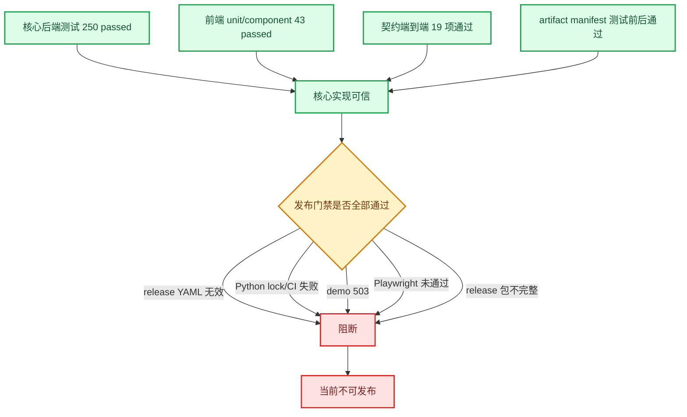

# 20260916 第五轮整改复核与 RAG 全项目增量审核报告

> 文档类型：独立整改复核 + 全项目增量审计。  
> 审核日期：2026-09-16。  
> 项目根目录：`F:\python\python_space\china-war\RAG`。  
> 审核分支：`round4-review-remediation`。  
> 审核 HEAD：`2e06aea4736c4663945f2e782e3c7c88e0647fd8`。  
> 远端状态：本地分支与 `origin/round4-review-remediation` 同步。  
> 审核范围：整个 `RAG/`，严格排除 `RAG/new/`。  
> 上游工作单：`docs/changes/20260916-round4-review-remediation-work-order.md`。  
> 被审核总结：`docs/changes/20260916-round4-review-remediation-summary.md`。  
> 本轮约束：不修改业务代码，只新增本审核报告。

---

## 一、最终结论

本轮修改显著提升了核心代码质量：后端 250 条测试、前端 43 条单元/组件测试、类型检查、构建、bundle 门禁和契约级端到端检查均可复现通过；同名实体纠正契约和客户端资源对象等关键实现也真实存在。

但是，**不能接受整改总结中的“13 项中 11 项已完成、2 项部分完成”结论**。总结表格自身实际为 8 项完成、4 项部分完成、1 项未完成；进一步结合动态验证、GitHub Actions 和全项目静态复核后，本报告重新裁定为：

| 状态 | 数量 | 项目 |
| --- | ---: | --- |
| ✅ 已完成 | 2 | P1-2、P1-3 |
| ⚠️ 部分完成 | 8 | P0-3、P0-4、P1-5、P1-12、P1-13、P2-3、P2-4、P2-5 |
| ❌ 未完成 | 3 | P2-1、P2-6、P2-7 |
| 合计 | 13 | — |

### 发布结论

**当前不能发布。** 主要阻断如下：

1. `.github/workflows/release.yml` 不是合法 YAML，GitHub 运行 0 秒直接失败；
2. Python lock 没有 hashes，CI 却强制 `--require-hashes`，Python 3.11 安装失败；
3. 同一份 Python 3.11 lock 还包含 Python 3.9 不兼容版本，3.9 矩阵同样失败；
4. `/api/demo/examples` 仍返回 503；
5. Playwright 浏览器验收未完成，本机实际为 12 failed；
6. release workflow 忽略 smoke 失败，且打包内容不包含完整源码、前端 dist、snapshot/index/eval；
7. Playwright 产生的未跟踪目录会使后续 clean-worktree 发布门禁失败。



---

## 二、验证结果汇总

### 2.1 本地动态验证

| 验证项 | 实际结果 | 判定 |
| --- | --- | --- |
| `pytest tests -q` | `250 passed in 16.54s` | 通过 |
| `npm run verify` | 43 tests、typecheck、build、bundle 全通过 | 通过 |
| Python `compileall` | 退出码 0 | 通过 |
| `scripts/check_docs.py --strict` | 通过 | 通过 |
| `scripts/check_secrets.py` | 未发现明文密钥 | 通过 |
| `git diff --check` | 通过 | 通过 |
| manifest verify（测试前） | 36/36 一致 | 通过 |
| manifest verify（测试后） | 36/36 一致 | 通过 |
| `npm run test:contract` | 19 项全部通过 | 通过 |
| `/api/health` | HTTP 200、status=ok | 通过但元数据有偏差 |
| `/api/demo/examples` | HTTP 503 | 未通过 |
| `npm run test:e2e` | 12 failed，Chromium 不存在 | 未通过 |
| Windows 默认控制台运行 smoke | `UnicodeEncodeError` | 未通过 |
| `PYTHONUTF8=1` 后运行 smoke | demo 503，退出码 1 | 未通过 |
| `pip install --dry-run --require-hashes -r requirements-dev.lock` | 缺少 hashes，退出码 1 | 未通过 |
| 标准物理 SHA256SUMS 检查 | Chroma SQLite 1 项不一致 | 未通过 |

### 2.2 GitHub Actions 实际状态

远端分支最新运行：

- CI run：`35055386288`，结论 **failure**；
- release workflow run：`35055385590`，结论 **failure**，0 秒、无 jobs；
- 此前同分支的 CI/release runs 也均失败。

CI 具体结果：

| Job | 结果 | 原因 |
| --- | --- | --- |
| frontend | success | npm ci、typecheck、unit、component、build、bundle 均通过 |
| lint | success | 文档、密钥、diff 检查通过 |
| backend Python 3.11 | failure | lock 无 hash，但使用 `--require-hashes` |
| backend Python 3.9 | failure | `aiohappyeyeballs==2.7.1` 要求 Python ≥3.10；同一份 3.11 lock 不兼容 3.9 |
| release | failure | workflow YAML 无效，未创建任何 job |

因此文档中“CI 已建立”“release workflow 会执行”的表述只能说明文件存在，不能说明流水线可用。

---

# 三、上一轮 13 项整改逐项复核

## P0-3：外部客户端生命周期

### 已完成部分

- `data/index/embeddings.py` 新增 `EmbeddingClient`；
- Embedding 客户端暴露幂等 `close()`；
- Runtime 能枚举 generate/question/embedding 资源；
- 对应 shutdown 测试存在且通过。

### 仍有偏差

`server/api.py` lifespan 当前顺序是：

1. `await runtime.shutdown()`；
2. `shutdown_sync_pool()`。

这会先关闭 Embedding/LLM HTTP 客户端，再关闭同步池。若同步池中仍有运行中的 embedding 或 LLM fallback 任务，任务可能在客户端已关闭后继续访问资源。`shutdown_sync_pool(wait=False)` 又不会等待运行任务结束。

### 重新裁定

**⚠️ 部分完成。** 客户端资源对象已补齐，但“正常停机不遗留或破坏在途任务”的验收尚未完整证明。

### 修改建议

- 先停止接收新任务；
- 取消 queued 任务；
- 对 active 任务执行有上限的 drain/wait；
- 再关闭外部客户端；
- 增加“存在 active/queued 任务时 shutdown”的集成测试。

### 完成标准

- shutdown 时 queued 不再启动；
- active 在限定时间内结束或被明确记录；
- 不出现 closed client 被在途任务继续使用；
- 服务退出无未关闭线程、客户端和 coroutine 警告。

---

## P0-4：clean commit 与证据绑定

### 已完成部分

- 已建立并推送独立分支；
- 除排除范围 `new/` 外，审核开始时工作区干净；
- manifest 记录 clean 代码 commit `cbedc91`；
- health/release 信息字段已扩充；
- `release_info.git_status_lines()` 已排除约定外的 `new/`。

### 仍有偏差

1. 当前 HEAD 为 `2e06aea`，manifest/lineage 绑定 `cbedc91`。虽然后续仅为文档提交，但“当前运行 commit 与证据 commit 完全一致”仍未达到。
2. 真实命令：

```text
python scripts/run_server.py --version 20260915_v1
```

health 返回：

```text
version_selection=env_pinned
```

而不是声明的 `cli_explicit`。原因是 `scripts/run_server.py:40-42` 把 CLI 参数写入 `RAG_ACTIVE_VERSION` 后，`server.api` 再读取环境变量，来源信息丢失。
3. Playwright 会产生未跟踪的 `frontend/test-results/`；`.gitignore` 没有忽略该目录。运行浏览器测试后 health 会报告 `source_dirty=true`，后续 `--require-clean` 也会失败。

### 重新裁定

**⚠️ 部分完成。** clean 分支和证据基础已建立，但真实启动链路的版本来源、测试产物治理和 exact commit 绑定仍有缺口。

### 修改建议

- 增加独立来源变量或 app factory 参数，例如 `RAG_VERSION_SOURCE=cli_explicit`；
- 增加真实 `run_server.py --version` 集成测试，而不是只测试纯函数；
- `.gitignore` 增加：
  - `frontend/test-results/`；
  - `frontend/playwright-report/`；
- release 证据使用“tested_commit”和“evidence_commit”两个字段；
- 在 CI artifact 中保存不可变原始证据，避免证据文档提交改变 HEAD。

### 完成标准

- CLI 启动时 health 明确显示 `cli_explicit`；
- Playwright 后工作区仍满足发布 clean 规则；
- tested commit、evidence commit 和当前 release commit 关系明确可验证。

---

## P1-2：correction 严格契约

### 审核结果

- add/replace/remove 字段集合已明确；
- `source_entity_id` 与 `replacement_entity_id` 已分离；
- add 不再接受 replacement 冒充 name；
- 动作错配字段返回 400；
- 非法类型和多余字段有测试覆盖。

### 重新裁定

**✅ 已完成。** 未发现新的实质偏差。

---

## P1-3：同名实体全链路纠正

### 审核结果

- 前端 replace payload 同时携带 source ID 和 replacement ID；
- 后端优先按 replacement ID 获取目标实体；
- 同名多候选名称查询不再静默取第一项；
- 缓存键包含两个 ID；
- 后端、前端单元和组件测试均存在并通过。

### 重新裁定

**✅ 已完成。** 上一轮指出的核心正确性问题已真实修复。

---

## P1-5：同步工作池观测与预算

### 已完成部分

- active/queued 已分离；
- queued 满时拒绝；
- 排队 Future 可取消；
- 记录 rejected、cancelled_before_start、running_after_disconnect；
- 外部预算等于 deadline 时配置校验失败；
- 测试存在并通过。

### 仍有偏差

1. 服务刚启动、同步池尚未首次创建时，`/api/health` 返回：

```json
"sync_pool": {}
```

没有稳定的 active/queued/rejected schema；只有第一次查询后才出现完整字段。
2. shutdown 顺序和 active drain 问题与 P0-3 相同。

### 重新裁定

**⚠️ 部分完成。** 核心容量隔离已完成，但 health 契约和停机行为还未完全闭合。

### 完成标准

- 服务启动后首次 health 就返回完整零值统计；
- shutdown 对 active/queued 的行为有测试并满足资源关闭顺序。

---

## P1-12：前端正式测试体系

### 已完成部分

- Vitest 已接入；
- Vue Test Utils 已接入；
- 27 条 unit + 16 条 component 均通过；
- Playwright 配置和 E2E 文件存在；
- npm scripts 已分层；
- 远端 frontend job 通过。

### 仍有偏差

- 本机 `npm run test:e2e` 实际为 12 failed；
- 普通 `ci.yml` 不运行 Playwright；
- 只有当前无效的 `release.yml` 声称运行 Playwright；
- 浏览器用例未获得任何一次成功运行证据；
- Playwright 输出目录未被忽略，会污染发布 clean 状态。

### 重新裁定

**⚠️ 部分完成。** 单元和组件层已完成，浏览器层仍未完成。

### 完成标准

- Chromium 安装成功；
- desktop/mobile E2E 全部通过；
- 普通 CI 或受保护的 required check 中执行 Playwright；
- 测试结果目录被忽略或显式清理；
- GitHub Actions 有绿色浏览器 job。

---

## P1-13：可访问性浏览器验收

### 已完成部分

- dialog、aria-modal、Escape、焦点回退、tablist、aria-selected、live region、reduced-motion 等实现存在；
- 组件层 ARIA 测试通过。

### 仍有偏差

- 浏览器行为测试未成功运行；
- E2E 用例只验证“焦点进入抽屉”和 Escape 回焦，没有实际执行 Tab/Shift+Tab 循环，不能证明焦点陷阱；
- 没有自动可访问性扫描或等价的严重级问题检查。

### 重新裁定

**⚠️ 部分完成。** 代码实现较完整，但验收证据不足。

### 完成标准

- Playwright 实际验证 Tab/Shift+Tab 焦点不会逃逸；
- 桌面与移动路径通过；
- 可选接入 axe，并保证无 serious/critical 问题。

---

## P2-1：真实 demo 制品

### 审核结果

`data/eval/20260915_v1/demo_examples.json` 仍为旧版本：

```text
version=20260904_v2
measurement_mode=null
source_run=run_20260913_postaudit
```

本地服务：

```text
GET /api/demo/examples → 503
```

UTF-8 模式 smoke 也因此退出码 1。

### 重新裁定

**❌ 未完成。** 当前诚实返回 503 是正确防护，但不等于功能完成。

### 完成标准

- 在固定 commit/config 下执行真实模型 run；
- demo version、source run、runtime version 一致；
- `measurement_mode=real_llm`；
- demo API 返回 200；
- smoke 和浏览器示例路径通过。

---

## P2-3：artifact manifest 稳定性

### 已完成部分

- manifest 测试前后均能 36/36 verify；
- Chroma SQLite 使用逻辑哈希，运行态物理变化不再误报；
- 未登记文件可被双向比对发现；
- dirty build 有测试。

### 仍有偏差

1. `data/release/SHA256SUMS` 将 Chroma SQLite 的**逻辑哈希**写成标准文件 SHA-256 行。标准物理校验结果：

```text
physical = 180f981082a8488cf26a7cb921a10346dbe9b939b35e357985054fc5458996f6
listed   = a455d73330d2bd2f390366c3da63abd86abf859b3aeb1831e4bb66d4e67c7482
```

因此标准 `sha256sum -c` 语义不成立。
2. manifest 的 `git_commit` 带尾部换行，JSON 中表现为 `"...\n"`，不利于严格比较。

### 重新裁定

**⚠️ 部分完成。** 自定义 manifest verify 已稳定，但标准 SHA256SUMS 和元数据规范化仍有问题。

### 修改建议

- SHA256SUMS 只写物理文件哈希；
- 逻辑哈希保留在 artifact manifest，并明确 `hash_mode=sqlite_logical`；
- 或生成独立 `LOGICAL_HASHES.json`；
- `_git()` 返回值统一 `.strip()`；
- 增加标准 SHA256SUMS 校验测试。

### 完成标准

- `sha256sum -c SHA256SUMS` 或等价物理校验全部通过；
- 自定义逻辑哈希校验也通过；
- commit 字段没有空白字符。

---

## P2-4：完整数据血缘

### 已完成部分

- 已生成 lineage；
- 上游数据库和原始文本有 size/hash；
- snapshot/index/eval/release 有主要 hash；
- 记录 Python/Node/Chroma/SQLite 版本；
- lineage 进入 artifact manifest。

### 仍有偏差

lineage 当前同时记录：

- `eval.latest_run = v5_coords_v1`，版本为 `20260915_v1`，`llm_used=false`；
- `demo.source_run = run_20260913_postaudit`，版本仍为 `20260904_v2`。

这只是记录了两个不一致节点，并没有形成 `eval run → demo` 的真实父子关系。P2-1 未完成时，完整 lineage 也不能判完全闭合。

此外尚未看到独立 JSON schema 对 lineage 字段和父子一致性进行验证。

### 重新裁定

**⚠️ 部分完成。** 血缘框架已建立，但 demo 链路尚未闭合。

### 完成标准

- demo 的 source_run 在 lineage 中可找到并 hash 对应；
- run/demo/runtime 版本一致；
- lineage schema 与跨层一致性检查进入 CI。

---

## P2-5：Chroma segment 审计

### 已完成部分

- collection→segment 映射已生成；
- 孤儿目录已先备份再移出；
- 当前磁盘段目录只保留被引用目录；
- ids 和 embeddings 均为 9544；
- get/query 抽样曾成功。

### 仍有偏差

`scripts/audit_chroma_segments.py:125-147` 读取 manifest 计数的位置错误：

```python
manifest_count = (m.get("counts") or {}).get("vectors") or m.get("vector_count")
```

实际 index manifest 的计数位于：

```text
m["vectors"]["count"]
```

因此报告中：

```json
"manifest_vector_count": null,
"counts_consistent": true
```

`counts_consistent` 只比较 ids 与 embeddings，没有比较 manifest count，低于工作单验收要求。

### 重新裁定

**⚠️ 部分完成。** 映射和清理主体完成，但计数一致性判定不完整。

### 完成标准

- 正确读取 `manifest["vectors"]["count"]`；
- ids、embeddings、collection count、manifest count 四者全部参与一致性判断；
- 任意一个为空或不一致时脚本退出非零；
- 增加对应自动化测试。

---

## P2-6：Python 锁文件

### 审核结果

两个 lock 文件存在，但没有任何 `--hash=`。CI 发现 lock 后无条件执行：

```text
pip install --require-hashes -r requirements-dev.lock
```

本地与 GitHub Python 3.11 均确认失败。

Python 3.9 还额外失败于：

```text
aiohappyeyeballs==2.7.1 Requires-Python >=3.10
```

这说明由 Python 3.11 生成的单一 lock 与声明的 3.9/3.11 矩阵不兼容。

整改总结称“CI 已兼容两种形态：有 lock 用 hashes，否则回退”，但当前 lock 始终存在且无 hashes，不会进入回退分支。

### 重新裁定

**❌ 未完成。** 当前 lock 不仅未满足验收，还直接导致后端 CI 全部失败。

### 修改建议

二选一并统一文档：

1. 正式只支持 Python 3.11：
   - CI 移除 3.9；
   - 用 3.11 生成带 hashes 的 lock；
2. 同时支持 3.9/3.11：
   - 生成按 Python 版本拆分的 lock/constraints；
   - 两个环境分别验证安装。

在 hashes 未完成前，CI 不得使用 `--require-hashes`，但这只能作为临时方案，不能标记 P2-6 完成。

### 完成标准

- 干净环境仅依赖 lock 安装成功；
- 声明支持的每个 Python 版本都能安装并运行全量测试；
- GitHub backend jobs 全绿；
- lock 包含完整 hashes。

---

## P2-7：CI 与 release artifact

### 审核结果

该项存在多项发布阻断，不能判完成。

#### 1. release workflow YAML 无效

`.github/workflows/release.yml` 的 Python heredoc 内容未缩进到 YAML block scalar 内，例如第 56-62 行从行首开始。YAML 解析失败，GitHub run 为 0 秒 failure、无 jobs。

#### 2. CI 后端失败

详见 P2-6。当前 CI 不是绿色流水线。

#### 3. smoke 失败被忽略

release workflow 使用：

```bash
python scripts/smoke_deploy.py ... || true
```

除 demo 外的查询、引用、缓存、限流等 smoke 失败都不会阻止发布。

#### 4. Playwright 产物污染 clean gate

Playwright 在 manifest build 之前运行并生成 `frontend/test-results/`，该目录未被 `.gitignore` 忽略。后续 `build --require-clean` 会失败。

#### 5. release 包内容不完整

打包步骤只复制：

- artifact manifest/SHA256SUMS/lineage/Chroma audit；
- requirements 与 lock；
- package.json/package-lock。

没有复制：

- 源码或 source archive；
- frontend dist；
- snapshot/index；
- eval/demo；
- smoke report；
- SBOM。

这不满足“在另一台机器下载后 verify 并启动服务”的目标。

#### 6. SBOM 不是有效完整 SPDX

当前仅写 `spdxVersion/name/packages`，缺少 SPDX 文档必需字段，也没有 Node 依赖；且 sbom 没有复制进最终 release 目录。

#### 7. 数据制品下载缺少信任校验

workflow 只打印下载 zip 的 SHA-256，没有与预期 hash 比较；随后直接 `ZipFile.extractall('.')`。缺少：

- expected checksum 输入；
- 签名验证；
- zip-slip 路径检查；
- 解包范围限制。

### 重新裁定

**❌ 未完成。** 文件框架存在，但实际 CI/release 均不可用。

### 完成标准

- workflow YAML 可解析；
- GitHub release job 实际创建并运行；
- 后端/前端/Playwright/smoke/demo/manifest 全部为硬门禁；
- 不使用 `|| true` 吞掉 smoke；
- 数据 zip 必须校验预期 hash并安全解包；
- Playwright 产物被忽略或清理；
- release 包包含源码、dist、数据、eval/demo、manifest、lineage、smoke、SBOM、locks；
- 在另一台机器成功 verify 和启动；
- GitHub Actions run 为绿色。

---

# 四、全 RAG 项目新增问题

以下问题不完全属于上一轮 13 项，或在本轮修改后才暴露。

## R5-1：Windows smoke 脚本编码崩溃

### 位置

- `scripts/smoke_deploy.py:129-134`

### 问题

输出使用 `✓/✗`。在 Windows GBK 控制台中直接触发 `UnicodeEncodeError`，导致 health 检查阶段即崩溃。

### 解决建议

- 根据 `sys.stdout.encoding` 选择 ASCII `[OK]/[FAIL]`；或
- 使用安全输出函数并设置 `errors="replace"`；
- 文档可建议 `PYTHONUTF8=1`，但脚本本身仍应跨平台安全。

### 验收标准

Windows 默认 PowerShell/GBK、UTF-8 PowerShell 和 Linux 均能运行，不因日志符号崩溃。

---

## R5-2：唯一事实源的数据集数字错误

### 位置

- `docs/current-status.md:13`

### 问题

文档写：

```text
10925 实体 / 17730 关系 / 9544 向量条
```

实际 health 和 snapshot manifest 为：

```text
9925 实体 / 17700 关系 / 9544 向量条
```

唯一事实源本身错误，会继续传播到其他 current 文档。

### 验收标准

- 数字从 manifest/health 自动生成或检查；
- `check_docs.py --strict` 增加实际数据计数一致性检查。

---

## R5-3：整改总结状态统计错误

### 位置

- `docs/changes/20260916-round4-review-remediation-summary.md:9`

### 问题

总结写“11 完成、2 部分”，但其表格实际是：

- 8 完成；
- 4 部分；
- 1 未完成。

结合本轮复核后，应进一步修正为 2 完成、8 部分、3 未完成。

### 验收标准

总结数字由表格自动统计或人工复核，标题结论与逐项状态一致。

---

## R5-4：Playwright 测试输出未忽略

### 位置

- `.gitignore`
- `frontend/test-results/`
- `frontend/playwright-report/`

### 影响

- 本地 health 误报 dirty；
- release clean gate 失败；
- 测试痕迹可能被误提交。

### 验收标准

运行 Playwright 后 `git status --porcelain -- ':!new'` 仍为空。

---

## R5-5：生产 CORS 默认仍为通配符

### 位置

- `server/api.py:75-82`
- `config/defaults.py`
- `.env.example`

### 风险

生产若未显式配置 `CORS_ALLOW_ORIGINS`，任意网站都可从浏览器调用公开查询接口。项目没有登录，虽然有内存限流，但仍可能被跨站消耗配额和模型成本。

### 建议

- 当 `RAG_REQUIRE_ACTIVE_VERSION=true` 时，若 CORS 仍为 `*`，启动警告或 fail-fast；
- 若确实需要公开 API，增加显式 `ALLOW_PUBLIC_CORS=true` 确认项。

### 验收标准

生产配置不会因漏配而静默启用 wildcard CORS。

---

## R5-6：health 同步池 schema 在首次请求前不稳定

### 位置

- `server/sse.py:184-186`
- `server/api.py:390`

### 问题

同步池未初始化时返回 `{}`，初始化后才返回完整统计对象。监控系统无法依赖固定 schema。

### 验收标准

首次 health 即返回所有字段的零值对象。

---

## R5-7：release 元数据 commit 字符串未规范化

### 位置

- `scripts/build_artifact_manifest.py` 的 `_git()` 与 `git_commit` 写入。

### 问题

manifest 中 commit 带换行符。虽然不影响当前自定义 verify，但会影响严格 JSON 比较、签名和外部工具消费。

### 验收标准

commit/branch/version 等标识统一 trim，并有格式测试。

---

# 五、未发现新的实质问题的部分

本轮在以下核心路径没有发现新的发布阻断级业务逻辑问题：

1. 请求体大小与字段边界；
2. SSE heartbeat 与整体 deadline；
3. error/done 状态转移；
4. 严格单流与取消；
5. 流式持久化和 schema 迁移；
6. 缓存键纠正语义；
7. 限流活跃 key 不被淘汰；
8. 原始 reasoning 默认不外发；
9. 动态 chunk 加载失败降级；
10. cancelled 面板空状态；
11. 首屏不预加载 ECharts/地图；
12. Markdown 渲染禁用原始 HTML，未发现直接 v-html 注入路径；
13. 契约端到端的 SSE、缓存、400 错误和同源托管。

这些结论由现有测试和本轮动态验证支持，但不替代未来真实模型、真实浏览器和生产代理环境的验收。

---

# 六、推荐整改顺序

## 阶段 1：恢复 CI 基础可用性

1. 修复 Python lock 策略；
2. 明确 Python 3.9 是否仍受支持；
3. 修复 release.yml YAML；
4. 推送后确认 CI backend 3.11/3.9 和 release workflow 能创建 job。

### 阶段 1 验收

- GitHub CI 全绿；
- release workflow 不再 0 秒失败；
- lock 在声明的 Python 版本中可安装。

## 阶段 2：修复发布门禁

1. 移除 smoke 的 `|| true`；
2. 忽略/清理 Playwright 输出；
3. 安全下载并校验数据 artifact；
4. 修复完整 release 包；
5. 生成有效 SBOM；
6. 修正 SHA256SUMS 语义。

### 阶段 2 验收

- release job 完整跑完；
- 另一台机器可下载、verify、启动；
- 所有 smoke 失败都会阻断发布。

## 阶段 3：完成数据与浏览器闭环

1. 执行真实模型 run；
2. 重建 demo；
3. 安装 Chromium 并跑 Playwright；
4. 修正 lineage 的 demo 父子关系；
5. 修复 Chroma manifest count 校验。

### 阶段 3 验收

- demo API 200；
- Playwright desktop/mobile 全绿；
- lineage 和 Chroma 四方计数一致。

## 阶段 4：运行时与文档收口

1. 修复 CLI 版本来源；
2. 修复 shutdown 顺序；
3. smoke 跨平台输出；
4. 修正 current-status 数字与整改总结统计；
5. 固定 health sync_pool schema；
6. 生产 CORS 显式配置。

---

# 七、最终发布门禁

以下条件全部满足前，不应合并为“可发布”：

- [ ] `ci` 所有 jobs 为绿色；
- [ ] `release.yml` YAML 合法并成功创建 jobs；
- [ ] Python lock 可在所有声明版本安装；
- [ ] 后端全量测试通过；
- [ ] 前端 unit/component/build/bundle 通过；
- [ ] Playwright desktop/mobile 通过；
- [ ] demo API 返回 200；
- [ ] smoke 退出码为 0，且失败不能被忽略；
- [ ] manifest 与标准 SHA256SUMS 均通过；
- [ ] Chroma 四方计数一致；
- [ ] lineage 中 run→demo→runtime 关系一致；
- [ ] release artifact 包含完整源码、dist、数据、eval/demo、证据和 SBOM；
- [ ] 下载数据制品有预期 hash/签名验证和安全解包；
- [ ] clean commit、tested commit、evidence commit 明确；
- [ ] current-status 与实际 health/CI 一致；
- [ ] 未修改或提交 `RAG/new/`；
- [ ] 无密钥、Token、密码进入仓库或发布包。

---

# 八、最终评价

本轮修改不是“无效整改”：P1-2、P1-3 已完成，后端/前端核心测试数量和质量均明显提升，manifest 逻辑哈希也解决了上一轮 Chroma 运行态改写导致的重复校验问题。

但整改方对发布工程的完成度判断明显偏高。当前最严重的问题不是核心问答代码，而是：

- 流水线实际失败；
- release workflow 语法无效；
- lock 策略与 CI 自相矛盾；
- demo 和浏览器验收未完成；
- 发布包和供应链校验不完整。

因此最终裁定为：

> **核心代码主体可继续迭代，发布链路不可用，项目当前不具备正式发布条件。**

下一轮应优先修复 CI/release，不应继续用“环境限制”替代实际绿色流水线证据。
